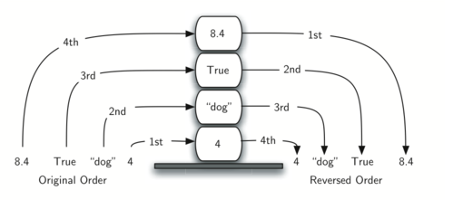
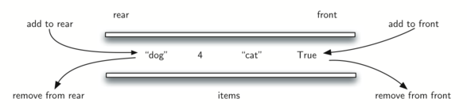

# ☯ gods

This post is inspired by Problem Solving with Algorithms 
and Data Structures using Python and C++

## 1. Basic Data Structures

### Stack

**LIFO, Last-in first-out**



#### Operations
* `Size()` returns the number of items on the stack.
* `Push(item)` adds a new item to the top of the stack.
* `Pop()` removes and returns the top item from the stack.
* `Peek()` returns the top item from the stack.
* `IsEmpty()` tests to see whether the stack is empty and returns a boolean value.

#### Implementation

```go
type Stack struct {
    items []int
}

// Size() returns the number of items on the stack.
func (s *Stack) Size() int {
    return len(s.items)
}

// Push(item) adds a new item to the top of the stack.
func (s *Stack) Push(i int) {
    s.items = append(s.items, i)
}

// Pop() will remove a value at the end and return the item.
func (s *Stack) Pop() int {
    l := s.Size()
    toRemove := s.items[l-1]
    s.items = s.items[:l-1]
    return toRemove
}

// Peek() returns the top item from the stack.
func (s *Stack) Peek() int {
    l := s.Size()
    return s.items[l-1]
}

// IsEmpty() tests to see whether the stack is empty and returns a boolean value.
func (s *Stack) IsEmpty() bool {
    return s.Size() == 0
}
```

#### Decimal to any Base


```go
func baseConverter(decNumber int, base int) string {
	remStack := Queue{}
	for decNumber > 0 {
		rem := decNumber % base
		remStack.Push(rem)
		decNumber = decNumber / base
	}
	newString := ""
	for !(remStack.IsEmpty()) {
		newString = newString + strconv.Itoa(remStack.Pop())
	}
	return newString
}
```

### Queue

**FIFO, first-in first-out or first-come first-served.**


#### Operations

#### Operations

* `Size()` returns the number of items in the queue.
* `Enqueue(item)` adds a new item to the rear of the queue.
* `Deque()` removes and returns the front item from the queue.
* `IsEmpty()` tests to see whether the queue is empty and returns a boolean value.

#### Implement

```go
type Queue struct {
	items []int
}

// Size() returns the number of items in the queue.
func (s *Queue) Size() int {
	return len(s.items)
}

// Enqueue(item) adds a new item to the rear of the queue.
func (s *Queue) Enqueue(i int) {
	s.items = append(s.items, i)
}

// Deque() removes the front item from the queue and returns the item.
func (s *Queue) Deque() int {
	toRemove := s.items[0]
	s.items = s.items[1:]
	return toRemove
}

// IsEmpty() tests to see whether the queue is empty and returns a boolean value.
func (s *Queue) IsEmpty() bool {
	return s.Size() == 0
}
```

### Deque

**A double-ended queue**



#### Operations

* `Size()` returns the number of items in the deque.
* `AddFront(item)` adds a new item to the front of the deque. 
* `AddRear(item)` adds a new item to the rear of the deque. 
* `RemoveFront()` removes and returns the front item from the deque.
* `RemoveRear()` removes and returns the rear item from the deque.
* `IsEmpty()` tests to see whether the deque is empty and returns a boolean value.

#### Impleent

```go
type Deque struct {
	items []int
}

// Size() returns the number of items on the stack.
func (s *Deque) Size() int {
	return len(s.items)
}

// AddFront(item) adds a new item to the front of the deque.
func (s *Deque) AddFront(i int) {
	s.items = append(s.items, i)
}

// AddRear(item) adds a new item to the rear of the deque.
func (s *Deque) AddRear(i int) {
	currentDequeue := s.items
	s.items = []int{i}
	s.items = append(s.items, currentDequeue...)
}

// RemoveFront() removes the front item from the deque and returns the item.
func (s *Deque) RemoveFront() int {
	toRemove := s.items[0]
	s.items = s.items[1:]
	return toRemove
}

// RemoveRear() removes the rear item from the deque and returns the item.
func (s *Deque) RemoveRear() int {
	l := s.Size()
	toRemove := s.items[l-1]
	s.items = s.items[:l-1]
	return toRemove
}

// IsEmpty() tests to see whether the deque is empty and returns a boolean value.
func (s *Deque) IsEmpty() bool {
	return s.Size() == 0
}
```

#### Palindrome-Checker


```go
func Palchecker(aString string) bool {
	chardeque := Deque{}

	for _, ch := range aString {
		chardeque.AddRear(int(ch))
	}
	stillEqual := true

	for chardeque.Size() > 1 && stillEqual {
		first := chardeque.RemoveFront()
		last := chardeque.RemoveRear()
		if first != last {
			stillEqual = false
		}
	}

	return stillEqual
}
```

### Linked-List
**A linked list is a linear collection of data elements whose order is not determined by the placement in memory.**

#### Operations

* `PrintListData` prints all element in the list.
* `Add(item)` adds a new item to the list.
* `Remove(item)` removes the item from the list.
* `Search(item)` searches for the item in the list and returns a boolean value.
* `IsEmpty()` tests to see whether the list is empty and returns a boolean value.
* `Size()` returns the number of items in the list.
* `Append(item)` adds a new item to the end of the list making it the last item in the collection.
* `Index(item)` returns the position of item in the list.
* `Insert(pos,item)` adds a new item to the list at position pos.
* `Pop()` removes and returns the last item in the list.
* `Pop(pos)` removes and returns the item at position pos.

#### Implement

```go

```